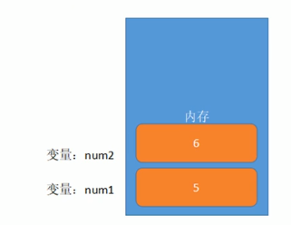
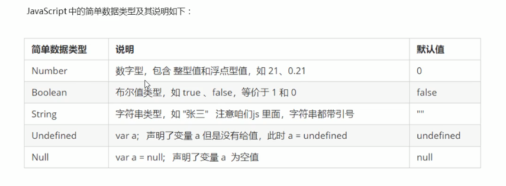
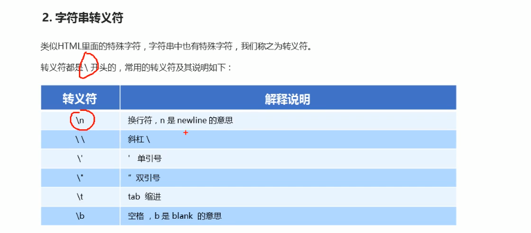

## 1. JavaScript 输入输出语句
### 1.1 三个输入输出方法
|方法|说明|归属|
|:--|:--|:--|
|alert(msg)|浏览器弹出警示浏览器|浏览器|
|console.log(msg)|浏览器控制台打印输入信息|浏览器|
|prompt(info)|浏览器弹出输入框，用户可以输入|浏览器|

## 2.变量
### 2.1 变量的概述
- 什么是变量
1.变量就是一个装东西的盒子。
2. 变量是用于存放数据的容器。我们通过变量名获取数据，甚至数据可以修改。
- 变量在内存中的存储
1. 本质：变量是程序在**内存**中申请的一块用来存放数据的空间。

### 2.2 变量的使用
-变量的使用分为两步：1. 申明变量 2.赋值
1. 声明变量
    //声明变量
    var age;// 声明一个名为age的变量

- **var**是一个JS关键字，用来声明变量。 声明变量后，计算机会分配内存给变量。
- age 是定义的变量名，我们要通过变量名来访问内存中分配的空间。
2. 赋值
利用‘=’赋值
### 2.3 变量语法扩展
- 更新变量
一个变量被重新赋值后，它原有的值就会被覆盖，变量值将以最后一次赋的值为准。
- 声明多个变量
var age = 18, address = '111'; 
-  声明变量的特殊情况
### 2.4 变量的命名规则
- 驼峰规则 首字母小写，后面单词的首字母需要大写，myFirstName
- 用有意义的单词命名
- name 也是关键字
- 只允许两种符号 $ _ 开头

## 数据类型简介
- 在计算机中，不同的数据所需占用的**存储空间是不同的**。
- javascript 是一种弱类型或者说是动态语言，不用提前声明变量的类型，在程序运行过程中，类型会被自动确定。
- 变量的数据类型可以变化，也就是相同的变量可用作不同的类型。
### 数据类型的分类
- JS把数据类型分为两类:
1. 简单数据类型(Number, String, Boolean, Undefined,Null)
2. 复制数据类型(object)\

- 数字类型可以包含整数和小数
- 常见的进制有二进制，八进制，十进制，十六进制。
-  数值型有最大值和最小值。MAX.VALUES MIN.VALUES
-  Infinity 代表无穷大，
-  -Infinity
- NaN 得不出结果

- IsNaN() 用来判断非数字，如果是数字，则返回false,不是则返回true.

- 字符串
字符串可以是引号中的任意文本，其语法位双引号，或者单引号。
推荐使用''
- 字符串嵌套，内双外单，外双内单
- 转义符 '\n' 换行 单引号

- 字符串长度 : 
字符串是由若干个字符组成的，这些字符的数量就是字符串的长度，通过字符串的length 属性可以获取整个字符串的长度。

- 字符串拼接
1. 多个字符串之间可以使用 + 进行拼接，其拼接方式 **字符串+任何类型=拼接之后的新字符串**
2. 拼接前会把**字符串相加的任何类型转成字符串**，在拼接成一个新的字符串
例如 'console.log('122'+true);'
输出的是 122true
